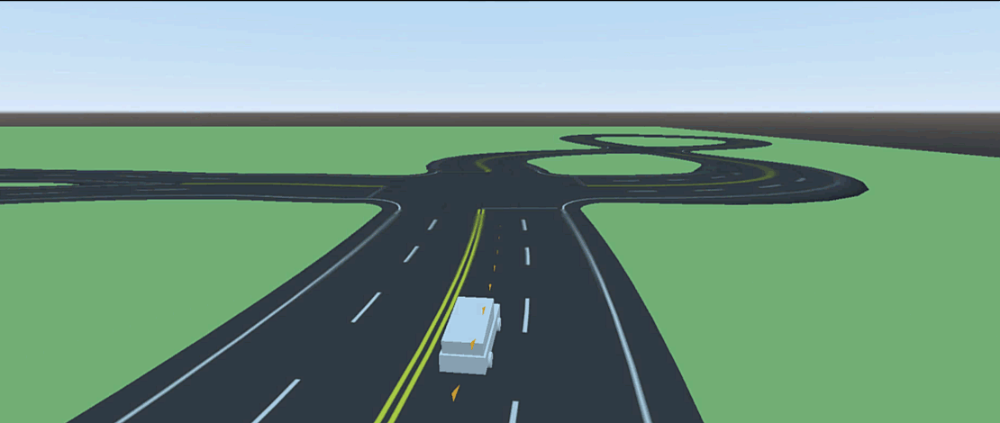

# Intersection demo

This demo shows off an example layout of roads using the built-in intersection pieces from the roads preset menu. The connection tool was then used to connect pieces of the road together to complete the segments.

## Player agent

This demo borrows the agent defined in the demo/procedural_demo project, where movement is "on rails" to avoid any physics complications, and to potentially maximize the number of agents usable at one time.

Use arrow keys to move:
- Up / down: accelerate forwards/backwards
- Left / right: Change to the left or right lane, if one is registered

It has also been set up so that it will automatically show the RoadLane currently being followed, the saw-tooth mesh that will appear on the road as the vehicle drives around. This helps you understand the path it is currently following, and whether there are any issues with said path.

## Known issues

The purpose of this demo is to show off how to connect prefab (intersection) pieces together, and is not focused on traffic simulation or agent movement, nor the related necessary management of intersection control. 

At the time of this writing, you will find the player agent in this demo scene gets stuck, and certain Road Lanes bend around in strange ways. This highlights a couple known issues that need to be resolved in AI pathing, see https://github.com/TheDuckCow/godot-road-generator/issues/171 for more details. The goal is to improve this functionality over time as the demo evolves.